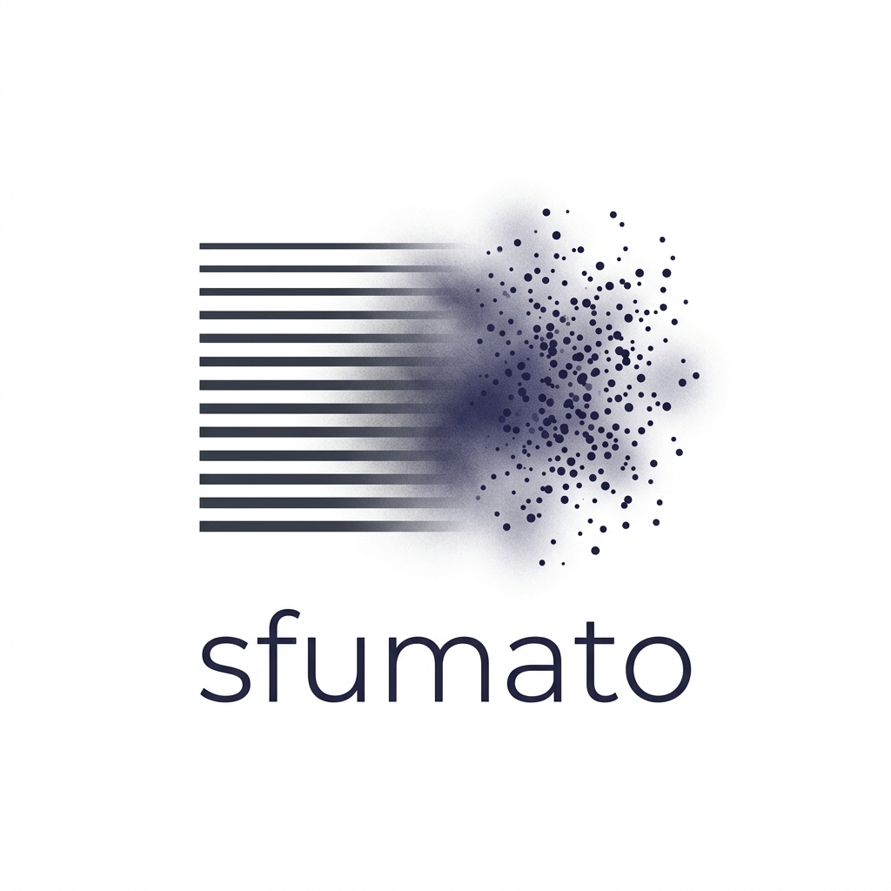

<p align="center">
  
</p>

# Sfumato: Three Orthogonal Failure Axes in Hybrid AR / Diffusion Reasoning

Hybrid pipelines that combine an autoregressive (AR) language model with a
discrete-diffusion language model (DDLM) for chain-of-thought reasoning have
produced mixed results in the literature, with conflicting reports on whether
AR planning helps DDLM denoising and whether DDLM sampling diversity is
useful. This paper argues those conflicts collapse once the failure surface is
decomposed: hybrid AR/DDLM reasoning fails along **at least three orthogonal
axes** — interface-format brittleness, planner-content trust, and
sampling-diversity preservation — that can be characterized and intervened on
independently.

On GSM8K with LLaDA-8B-Instruct + Qwen2.5-{0.5B,1.5B}-Instruct:

- **Axis 1 (interface-format brittleness)** is fixable with a small (`r=8`)
  prefix-robustness LoRA, with a measurable capacity tradeoff between
  no-prefix accuracy and branch-vote ceiling.
- **Axis 2 (planner-content trust)** is capacity-dependent in opposite
  directions across planners: a 0.5B planner improves at higher LoRA
  capacity (+5 pp); a 1.5B planner regresses by 13 pp.
- **Axis 3 (sampling-diversity preservation)** is *expanded*, not collapsed,
  by format-augmented LoRA training (5/5-branch agreement 51.5% → 47.5%).
- **Consensus distillation** is design-sensitive, not architecture-limited:
  late-block answer-span surgery fails (`c2c` = 70.5% across two iterations);
  earlier-block full-response surgery recovers (`c2c` = 79.0%, within
  sampling error of the 80% pre-registered target). Disentangling ablations
  attribute most of the lift (+4 pp) to where commit fires in the diffusion
  schedule. Branch aggregation on top reaches `cmajc` = 82.5% (+3.5 pp over
  base test `cmaj`), showing param-time and compute-time consensus
  mechanisms compose. At b=5 the v2/v3 commits are statistically
  indistinguishable; the structural correction matters at b=1.

Total compute: ~$3.50 across all experiments on a single RTX-4090.

All datasets and adapters are public on the Hugging Face Hub (`eren23/sfumato-*`).

## Repo layout

```
paper/      LaTeX source, Makefile, bibliography, figures
docs/       Built main.pdf
video/      12 Manim scenes + render scripts
```

## Building the paper

```bash
cd paper
make         # pdflatex + bibtex + two more pdflatex passes; copies to docs/
```

## Building the video

```bash
cd video
PYTHON=python3 ./render_story.sh -ql      # 480p15 review cut
PYTHON=python3 ./render_story.sh -qh      # 1080p60 master
./review_frames.sh 480p15                 # extract review frames per scene
```

The video reuses helpers from `../visual_reps` (the manim toolkit). Override
that path with `VISUAL_REPS_PATH=/path/to/visual_reps` if needed.

## Artifacts

Adapters and datasets on the Hugging Face Hub:

- `eren23/sfumato-llada-prefix-robust-v2` (Track 1, 4/7-module LoRA)
- `eren23/sfumato-llada-prefix-robust-v3` (Track 1, 7/7-module LoRA)
- `eren23/sfumato-llada-commit-v2` (Track 2, last-block answer-span LoRA)
- `eren23/sfumato-llada-commit-v3` (Track 2, multi-block full-response LoRA)
- `eren23/sfumato-prefix-robust-gsm8k` (59,784 rows × 8 prefix tiers)
- `eren23/sfumato-consensus-gsm8k` (500 cmaj outputs)
- `eren23/sfumato-commit-mixture-gsm8k` (109-row mixture, three buckets)

W&B project: `wandb.ai/eren23/sfumato-e2` and `wandb.ai/eren23/sfumato-e4`.

## Citing

See `CITATION.cff` for BibTeX-equivalent metadata.

## Prior work

- First CodeWM preprint: <https://eren23.github.io/codewm-paper-public/>
- Second CodeWM preprint: <https://eren23.github.io/codewm2-paper-public/>
- Third CodeWM preprint (CodeDeltaTok): <https://github.com/eren23/codewm3-paper>

## License

MIT. See `LICENSE`.
